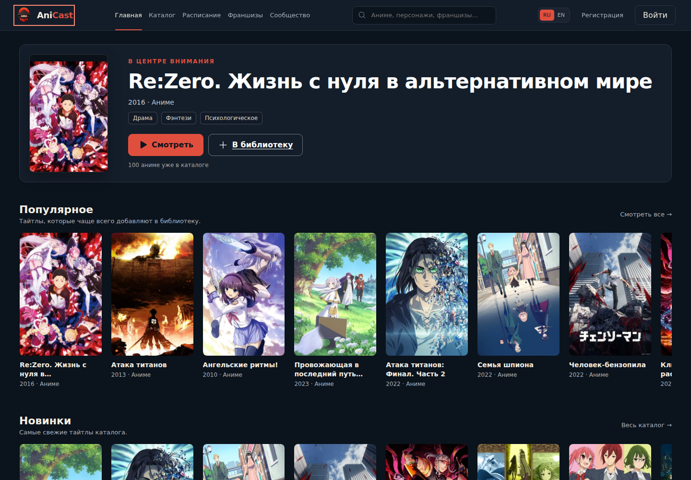
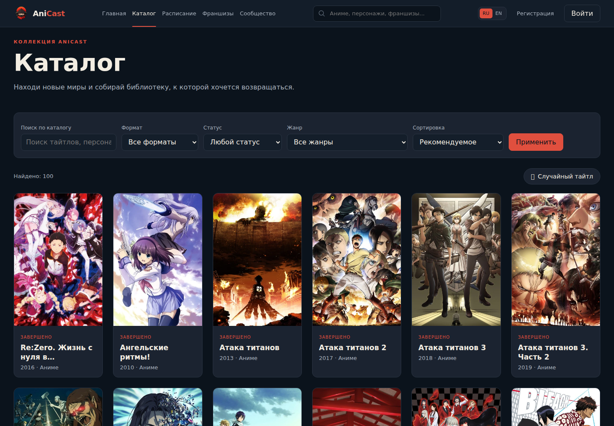
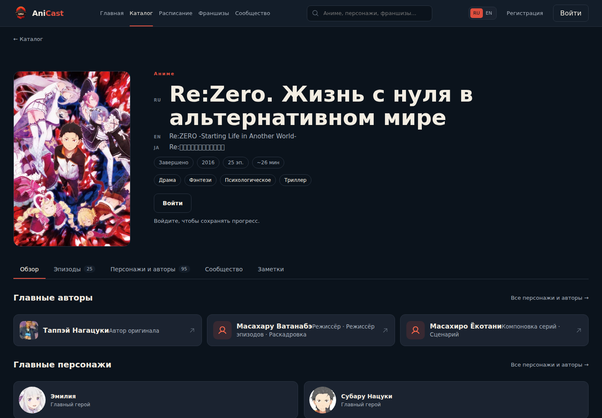
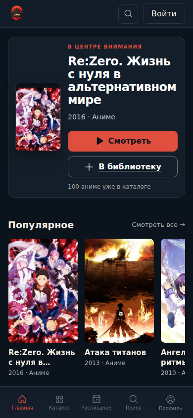

# AniCast design audit — 29 августа 2026

## Scope

Combined UX/accessibility audit публичного discovery-flow:

1. главная;
2. переход в каталог;
3. переход в карточку тайтла;
4. мобильная главная.

Цель пользователя: найти интересующий тайтл, понять его содержание и выбрать
следующее действие. Accessibility target: WCAG AA согласно проектным правилам.

Проверены production UI `https://anicast.online`, desktop 1440×1000, mobile
390×844, reduced motion, keyboard Tab sequence и автоматический axe scan.

## Steps

### 1. Главная desktop — healthy with significant follow-ups

Сильные стороны: ясный герой, заметное основное действие, стабильная навигация,
читаемые полки и видимый keyboard focus.

Риски: ссылка «В библиотеку» ведёт на ту же карточку тайтла, что и «Смотреть», а не
выполняет обещанное действие. Axe фиксирует недостаточный контраст brand accent,
eyebrow и footer metadata.

### 2. Каталог desktop — healthy with significant contrast debt

Сильные стороны: понятная иерархия, подписанные фильтры, количество результатов,
предсказуемая сетка и реальные постеры.

Риски: статус `ЗАВЕРШЕНО` на карточках не проходит AA contrast; axe подтвердил
нарушение на всех 20 карточках первого экрана. Placeholder поиска обрезается уже
на широком desktop, хотя постоянный label сохраняет смысл.

### 3. Карточка тайтла desktop — needs a focused layout fix

Сильные стороны: название и постер доминируют, метаданные сгруппированы, вход для
сохранения прогресса объяснён, tabs и секции легко сканируются.

Риски: имя и роль в карточках авторов слипаются. Причина в CSS: правило
`.creditCard > span:last-child` не выбирает content-span, потому что последним
ребёнком является SVG-стрелка. Японское название отображается missing glyphs в
capture environment. Axe также фиксирует контраст language labels, voice metadata
и retry control.

### 4. Главная mobile — visually healthy, focus order needs work

Сильные стороны: hero адаптирован без горизонтального переполнения, действия имеют
достаточный размер, bottom navigation понятна, горизонтальная полка доступна с
клавиатуры и прокручивается при фокусе.

Риски: Tab order после header проходит всю fixed bottom navigation, затем прыгает
обратно вверх к hero actions. Это расходится с визуальным порядком и может
дезориентировать keyboard/switch users. Подписи bottom navigation не проходят AA
contrast.

## Priority findings

Blocking findings в проверенном публичном flow не обнаружены.

### Significant

1. Исправить системный contrast: `--primary` на elevated/card surfaces и
   `--muted-2` в мелком тексте. Не менять токены вслепую: проверить все semantic
   roles и states после корректировки.
2. Исправить mobile focus order, чтобы fixed navigation не разрывала чтение между
   header и main content.
3. Сделать действие «В библиотеку» честным: выполнить добавление с корректным
   auth/pending/result flow либо переименовать ссылку в действие перехода.
4. Исправить content selector/layout карточек авторов и повторно проверить длинные
   имена и роли.
5. Обеспечить font fallback для японского текста и заменить emoji случайного
   тайтла на существующую Phosphor icon; в capture environment оба символа могут
   превращаться в missing glyph.

### Structural debt

В CSS вне `globals.css` найдено 62 hex-значения, 60 `rgb/rgba` и 29 gradients.
Это не повод для массового рефакторинга, но затронутые компоненты следует переводить
на семантические tokens при плановых изменениях.

## Validation

- `npm run lint` — passed; команда `next lint` помечена Next.js как deprecated.
- `npm run typecheck` — passed.
- `npm test` — 35/35 passed; Node сообщает `MODULE_TYPELESS_PACKAGE_JSON` warnings.
- `npm run build` — passed.
- Axe — `color-contrast` serious на всех четырёх шагах.
- Keyboard — проверены первые 24 focus targets на desktop и mobile; focus видим,
  кроме input, где состояние передаётся border родительского `focus-within`.

## Evidence limits

Не проверены авторизованные library/history/settings flows, screen reader output,
200% zoom, формы с ошибками и реальные playback states. Скриншоты сняты с текущего
production UI; локальные проверки кода прошли, но идентичность production commit с
workspace отдельно не подтверждалась.

Raw evidence: `audit-results.json`, `keyboard-results.json`.

## Local remediation pass

После production baseline локально исправлены все пять significant findings:

1. введены AA-safe `--muted-2` и `--accent-text`;
2. fixed mobile navigation перенесена после основного контента в DOM;
3. hero-действие библиотеки выполняет реальную мутацию с auth/pending/error/result states;
4. content карточки автора получил явный class вместо структурного `last-child` selector;
5. японские названия используют self-hosted Noto Sans JP, emoji рулетки заменён на Phosphor `DiceFive`.

Повторная локальная проверка: Axe — 0 нарушений на главной, каталоге и карточке
тайтла; long-name credit cards не пересекаются на 390, 900 и 1440 px; production
build и 35/35 тестов прошли. Визуальные подтверждения: `05-home-mobile-p1.png`,
`06-title-desktop-p2.png`, `07-catalog-random-p2.png`, `08-title-mobile-p2.png`.

Следующий token pass убрал все raw-цвета из `home.module.css`,
`catalog.module.css` и `title.module.css`. Повторяющиеся media, poster, playback,
semantic-state и favorite роли перенесены в `globals.css` и бренд-спецификацию.
Общий остаток вне `globals.css`: 34 hex, 35 rgb/rgba и 25 gradients — против
62, 60 и 29 в production baseline. Axe повторно показывает 0 нарушений на
локальных home, catalog и title captures; подтверждения сохранены как
`09-home-mobile-tokens.png`, `09-catalog-desktop-tokens.png` и
`09-title-desktop-tokens.png`.

Личный flow (`account`, `library`, `collections`, `settings`) также переведён на
семантические роли: raw-цветов в четырёх соответствующих CSS-модулях больше
нет. Профильные gradients и avatar shadow централизованы в `globals.css`,
favorite/active состояния используют общие tokens. Общий остаток вне
`globals.css` теперь составляет 26 hex, 25 rgb/rgba и 18 gradients.

При визуальной проверке исправлены два дополнительных дефекта: profile header
поднят над декоративным overlay баннера (аватар и identity больше не
перекрываются), а глобальный eyebrow использует контрастный `--accent-text`
вместо `--primary`. На account mobile, library desktop, collections desktop и
settings mobile: Axe — 0 нарушений, горизонтальный overflow — 0, keyboard focus
видим. Подтверждения: `10-account-mobile-tokens.png`,
`10-library-desktop-tokens.png`, `10-collections-desktop-tokens.png` и
`10-settings-mobile-tokens.png`.

Публичный flow `schedule + discovery` очищен следующим проходом: raw-цветов в
`schedule.module.css` и `discovery.module.css` больше нет, poster/fallback,
active, success, warning и primary states используют общие семантические роли.
Для мелкого success-текста добавлен контрастный `--success-text`; текстовые
primary-акценты переведены на `--accent-text`. Текстовый glyph dismiss-action в
рекомендациях заменён на Phosphor `X` с сохранённым доступным именем.

Общий остаток вне `globals.css`: 14 hex, 17 rgb/rgba и 13 gradients. Проверены
наполненные schedule и media, а также dismiss/undo рекомендаций. На ширинах 390,
900 и 1440 px: Axe — 0 нарушений, горизонтальный overflow — 0, focus видим;
стрелки в schedule tablist переключают выбранный день. Подтверждения:
`11-schedule-mobile-tokens.png`, `11-schedule-desktop-tokens.png`,
`11-media-desktop-tokens.png` и `11-recommendations-desktop-tokens.png`.

Социальный flow (`community`, публичный профиль и creator page) переведён на
семантические роли без raw-цветов в трёх затронутых CSS-модулях. Для публичного
профиля централизованы banner/avatar gradients и полупрозрачная stats surface;
малые акцентные подписи используют `--accent-text`.

В процессе исправлено поведение: фильтр community объявляется обычной группой
toggle-buttons с `aria-pressed`, а не неполной ARIA tab-системой; follow/unfollow
показывает локализованную inline-ошибку, сохраняет прежний счётчик при отказе и
разрешает повторную попытку. Также устранён contrast regression активного
community toggle в hover-состоянии. Общий остаток вне `globals.css`: 9 hex,
10 rgb/rgba и 9 gradients.

Populated, empty и API-failure/recovery состояния проверены на 390, 900 и 1440
px: Axe — 0 нарушений, horizontal overflow — 0, keyboard focus видим. При
follow failure счётчик остаётся 41, успешный retry переводит его в 42.
Подтверждения: `12-public-profile-mobile-tokens.png`,
`12-public-profile-desktop-tokens.png`, `12-community-desktop-tokens.png` и
`12-creator-desktop-tokens.png`.

Финальный structural pass охватил auth, global search, user/language menus, 404,
notifications, reports и оставшиеся composite surfaces. Все raw hex, rgb/rgba и
gradient declarations вынесены из маршрутных CSS-модулей в семантические tokens
`globals.css`. Итоговый остаток вне `globals.css`: **0 hex / 0 rgb/rgba /
0 gradients**.

Дополнительно исправлена системная семантика: language switcher использует
labelled group и `aria-pressed`; profile dropdown больше не заявляет неполную
ARIA menu-модель и возвращает фокус по Escape; report success/guest и notification
errors объявляются через status/alert. Search listbox получил допустимую
ARIA-иерархию grouped options, контрастный all-results action и детерминированный
Escape: на desktop фокус остаётся в combobox, на collapsed header возвращается
к search trigger.

Login API error сохраняет введённый email и показывает disabled pending state;
desktop/mobile search поддерживает Arrow navigation и active descendant. Auth,
search и 404 на 390 и 1440 px: Axe — 0 нарушений, horizontal overflow — 0.
Подтверждения: `13-login-mobile-tokens.png`, `13-search-desktop-tokens.png`,
`13-search-mobile-tokens.png` и `13-not-found-desktop-tokens.png`.

## Interaction and accessibility-tree pass

Финальный interaction QA прошёл по основным гостевым маршрутам на 390 px:
главная, каталог, расписание, сообщество, account, library, settings, login,
register и 404. Chrome accessibility tree не обнаружил безымянных ссылок,
кнопок, полей, combobox/options; на каждом маршруте по одному `main` и `h1`,
horizontal overflow — 0.

Исправлены два найденных дефекта. Filter navigation в library получил доступное
имя, поэтому AX-tree больше не содержит безымянный navigation landmark. Rating
в community panel объявлен как labelled single-choice group: все значения имеют
понятное имя и `aria-pressed`, выбранное состояние теперь доступно не только по
цвету. Loading/error/moderation states используют `status`/`alert`, мутации
блокируют повторную отправку через disabled и `aria-busy`.

После разведения landmarks на «Представление библиотеки» и «Фильтры библиотеки»
контрольный Axe на library: 0 нарушений, horizontal overflow: 0.

Keyboard-only smoke на production build подтвердил: profile disclosure открывается
через Enter, следующий Tab переходит на «Мой аккаунт», Escape закрывает popup и
возвращает фокус на trigger. Mobile search принимает ArrowDown, выставляет
`aria-activedescendant`, а Escape сворачивает sheet и возвращает фокус на search
trigger. Проверка выполнена по Chromium AX-tree и не заменяет ручное прослушивание
VoiceOver/NVDA. Динамический title/community экран не удалось повторно захватить
в браузере из-за недоступного backend; его изменения проверены статически,
TypeScript и production build.

## Reflow, forced colors and reduced motion

Следующий accessibility pass проверил основные гостевые маршруты на 320, 720 и
1440 CSS px с `prefers-reduced-motion: reduce` и forced-colors. Главная, catalog,
schedule, community, account, library, settings и 404 сохранили reflow без
горизонтального overflow. Login выходил за 320 px на 37 px, register — на 13 px:
auth card зависела от grid min-content, а длинное русское слово в login heading
расширяло содержимое.

Auth card переведена на `width: 100%`, `max-width` и `min-width: 0`; на ширине до
360 px уменьшены только внешние и внутренние gutters, а heading использует 28 px,
чтобы переноситься по словам. Итог: login/register overflow — 0, heading
`clientWidth === scrollWidth`. Header search input получил реальную высоту 36 px,
RU/EN controls — 32×32 px.

В reduced-motion режиме вычисленные animation и transition counts равны 0.
Forced-colors сохраняет границы, нативные поля, кнопки и focus outline 2 px;
структурный Axe (без неприменимого к системной палитре color-contrast rule) — 0
нарушений на login/register. В обычной палитре Axe также 0. Визуальное
подтверждение: `14-login-320-forced-colors.png`.

## Bilingual responsive and form-recovery matrix

Перед финальным commit выполнена расширенная production-матрица: 16 гостевых
маршрутов × RU/EN × 320/720/1440 = 96 page-state проверок; 32 мобильных состояния
дополнительно прошли Axe. Проверялись `html[lang]`, horizontal overflow, main/h1,
duplicate IDs и размеры native form-controls. Раннее чтение redirect/streaming
состояния catalog/characters временно видело две оболочки; изолированная проверка
после стабилизации DOM подтвердила один main, один h1 и Axe 0.

Подтверждённый bilingual defect: английский heading `Recommendations` был на
50 px шире viewport при 320 px. Общий mobile page-heading scale теперь использует
`clamp(27px, 8.5vw, 34px)` и допускает безопасный перенос длинного слова.

Статический form-аудит дополнительно исправил недоступные recovery details:
password requirements регистрации и slug hint коллекции связаны через
`aria-describedby`; textarea личной заметки получила native label. Save/delete
заметки теперь имеют различимые pending labels, блокируют конфликтующую мутацию,
объявляют подтверждённый success через `status`, error через `alert` и сохраняют
введённый текст при отказе. Native validation регистрации переводит фокус на
первое невалидное обязательное поле; password description присутствует в DOM.

## Approved interface iteration 1 — atmospheric home hero

После подтверждения пользователя hero главной получил декоративное продолжение
featured poster под адаптивным overlay. На desktop отдельный чёткий постер
сохранён слева, а размытый artwork заполняет ранее пустую правую часть. На mobile
отдельная poster card скрывается и тот же artwork становится фоном hero; данные,
CTA, loading/guest/error behavior и DOM reading order не менялись. При отсутствии
poster сохраняется прежняя `--surface-elevated` поверхность.

Production captures на 390 и 1440 px: horizontal overflow — 0, Axe — 0.
Подтверждения: `15-home-hero-mobile.png`, `15-home-hero-desktop.png`.
